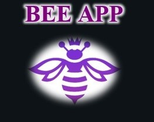

# 🧾 Planilha de Controle para Declaração de Imposto de Renda — Excel

## 📊 Descrição do Projeto

O BEE APP é uma planilha interativa desenvolvida em **Microsoft Excel** para auxiliar no controle e organização de dados fiscais, especialmente voltada para o preenchimento da declaração de imposto de renda.
A ferramenta foi construída com foco em usabilidade, automação e design intuitivo, permitindo que o usuário registre informações pessoais, informes bancários e notas de rendimento de forma centralizada e prática.

---

## 🐝 Sobre o Nome
**BEE APP** simboliza a eficiência e a organização — assim como as abelhas, o aplicativo busca otimizar o trabalho de coleta e registro de informações, tornando o processo fiscal mais simples e produtivo.

---

## 🧍 1. Dados do Titular
Tela inicial para o preenchimento dos dados do contribuinte, incluindo:
- Nome, CPF e data de nascimento
- Título de eleitor
- Informações de cônjuge e dependentes
- Endereço completo e contatos
- Opções de status fiscal (residente no exterior, alterações de entrega anterior, etc.)

🟣 Objetivo: reunir de forma padronizada todas as informações básicas para início da declaração.

---

## 💰 2. Informes Bancários
Área destinada ao controle de rendimentos e valores em conta, com campos para:
- Nome do banco
- Valor atual de cada conta
- Anexos e comprovantes
- Cálculo automático do total de rendimentos

🟣 Objetivo: facilitar a coleta e conferência de valores para o imposto de renda.

---

## 📄 3. Notas Bancárias ou Holerites
Planilha para registrar as entradas mensais de receitas, com colunas de:
- Data da transação
- Categoria do rendimento
- Valor correspondente

🟣 Objetivo: organizar os extratos bancários e holerites, permitindo uma visão clara das receitas ao longo do ano.

---

## 🧭 Navegação e Interface
O BEE APP conta com um menu lateral interativo, que facilita a navegação entre as seções:
- Titular 🧍
- Informes 💰
- Notas 📄

Além disso, há botões automáticos de navegação (Anterior / Próximo) e formatação visual em tons de roxo e lilás, reforçando a identidade visual do projeto.

---

## 🗂️ Como Usar
- Baixe o arquivo BEE APP.xlsx no repositório.
- Abra no Microsoft Excel (versão 2016 ou superior).
- Navegue pelos botões laterais e preencha os campos conforme sua necessidade.
- Utilize os botões “Anterior” e “Próximo” para trocar de seção.

---

## 🛠️ Tecnologias Utilizadas
- Microsoft Excel (com funções e validações de dados)
- Formatação condicional e menus interativos
- Links automáticos e botões de navegação
- Design personalizado com foco em UX

---

## 🎯 Objetivos de Aprendizagem
Este projeto foi desenvolvido como parte do desafio da  [DIO](https://www.dio.me) com o propósito de:
- Aplicar conceitos de automação e organização de dados no Excel;
- Documentar processos técnicos de forma estruturada e profissional;
- Utilizar o GitHub como ferramenta de versionamento e portfólio técnico.

---

## 👩‍💻 Autoria
Desenvolvido por: **Raiane Sá**

🌐 [LinkedIn](https://www.linkedin.com/in/raiane-s%C3%A1-165b6b193/)

---

## 🐝 Licença
Este projeto é de uso educacional e pode ser utilizado como base para fins de estudo ou portfólio, desde que mantidos os devidos créditos.

---
